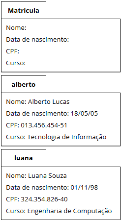

## Objetos, Construtores e Instâncias em Classes - Java
- Para representar dados específicos usando classes, é necessária a criação de **objetos** (ou **instâncias**) dessa classe.

- Os objetos são a materialização da classe e, assim, podem ser usados para representar dados e executar operações.

- Para que possam ser manipulados, é necessário criar **referências** a esses objetos, que são basicamente variáveis do "tipo" da classe.
Cada instância de uma classe possui os **mesmos atributos** definidos na classe.

---


---
### Criação por Referência

- A criação de objetos por referência é **similar à criação de variáveis de tipos primitivos**:

```java
NomeDaClasse nomeDoObjeto;
```

- **Exemplo:**

```java
Matricula mat;
```

- Isso cria uma variável do tipo `Matricula`. `mat` é uma **referência** para um objeto da classe `Matricula`. Ou seja, apenas declara a referência, mas **não cria o objeto** ainda.

### Criação do Objeto com `new`
- Para criar um objeto, usamos a palavra-chave `new`.

```java
Matricula mat = new Matricula();
```

ou

```java
Matricula mat;
mat = new Matricula();
```

- O operador `new`:

* Cria uma **instância** da classe e retorna a referência do novo objeto;
* **Aloca memória** para o novo objeto;
* Chama um **método especial de inicialização** da classe, chamado **construtor**;
* Retorna a **referência** para o novo objeto.

### Detalhamento

```java
Matricula mat;
```
- Ao declarar apenas a variável, o objeto ainda **não existe**. Seu conteúdo inicial será o valor **nulo** (`null`).
- O `null` é um valor válido em Java e permite comparações, como:

```java
if (cont == null)
```

```java
mat = new Matricula();
```

- Aqui, o objeto é **criado e inicializado**. A partir disso, é possível acessar os atributos e métodos do objeto.

### Valores Padrão
- Caso os campos de uma instância **não sejam inicializados**, os seguintes valores serão atribuídos por padrão:

* `int`: `0`
* `float`: `0.0`
* `boolean`: `false`
* `String`: `null`
* `char`: espaço em branco (`' '`)

---

## Utilizando Objetos

- Uma vez que um objeto tenha sido criado, seus **métodos e atributos públicos** podem ser acessados usando sua referência e o **operador ponto**:

```java
<identificador>.<método>
<identificador>.<atributo>
```

**Exemplos:**

```java
triangulo.calculaPerimetro();
triangulo.desc;
```

**Observação:** Para comparar objetos do tipo `String`, usamos o método `.equals`:

```java
str1.equals(str2);
```


## Construtores
- Construtores são **métodos especiais**, chamados **automaticamente** quando instâncias são criadas com a palavra-chave `new`.

* São executados **antes de qualquer outro método**;
* Devem ter **exatamente o mesmo nome da classe**;
* **Não possuem tipo de retorno**, nem `void`.

**Sintaxe:**

```java
NomeDaClasse(argumentos) {
    // Corpo do construtor
}
```

**Exemplo:**

```java
public class Matricula {
    private String nome;
    private int idade;
    private String curso;

    // Construtor
    public Matricula(String nome, int idade, String curso) {
        this.nome = nome;
        this.idade = idade;
        this.curso = curso;
    }
}
```
- O `this` é uma referência ao objeto atual, permitindo acessar atributos e métodos da própria classe.
- Como o `self` em Python.