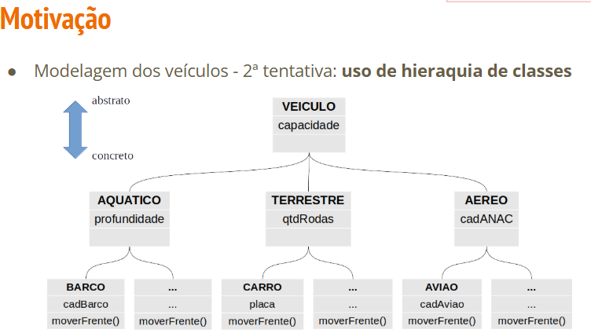

## Abstração
---


---

- A abstração é um dos quatro pilares fundamentais da POO (junto com Encapsulamento, Herança e Polimorfismo).

- O propósito de uma classe abstrata é fornecer uma superclasse apropriada a partir da qual outras classes podem herdar e assim compartilhar um modelo comum;
- **Uma classe abstrata não pode ser utilizada para instanciar objetos.**


- Pense em um carro. Para dirigir, você só precisa saber usar o volante, os pedais e a marcha. Você não precisa conhecer os detalhes de como o motor de combustão funciona, como a injeção eletrônica distribui o combustível ou como a transmissão engata as marchas. O carro **abstrai** toda essa complexidade para você, fornecendo uma interface simples (volante e pedais).


### 0.1 Classes Abstratas (`abstract class`)

- Uma classe abstrata é uma espécie de "modelo inacabado". - Ela serve como uma base para outras classes, mas **não pode ser instanciada diretamente**. Ou seja, você nunca poderá criar um objeto com `new NomeDaClasseAbstrata()`.

- Ela pode ter:

  * Atributos e métodos concretos (com implementação).
  * **Métodos abstratos** (sem implementação), que funcionam como uma **obrigação** para as classes filhas.

### Sintaxe **Para declarar a classe:**

```java
public abstract class NomeDaClasse {
    // atributos e métodos concretos aqui
}
```

- **Para declarar um método abstrato (sem corpo, apenas a assinatura):**
- Um método abstrato é não fornece implementação e tem a palavra-chave abstract na sua declaração;

```java

// Método abstrato: não tem corpo {} e obriga as classes filhas a implementá-lo.
public abstract tipoDeRetorno nomeDoMetodo(parametros);
```
- OBS: Uma classe abstrata pode ser derivada por outras classes que, por sua vez, deverão implementar seus métodos abstratos ou declarar-se também abstratas;

### Exemplo
**Arquivo: `Funcionario.java`**

```java
/**
 * CLASSE ABSTRATA: Funcionario
 * Define o que todo funcionário TEM (id, nome) e o que ele DEVE FAZER
 * (ter um método para calcular pagamento), mas não diz COMO calcular.
 *
 * Note que ela não pode ser instanciada: new Funcionario() dará erro!
 */
public abstract class Funcionario {
    private String nome;
    private String id;

    public Funcionario(String nome) {
        this.nome = nome;
        // ... lógica do ID ...
    }

    // Método concreto (comum a todos os funcionários)
    public String getNome() {
        return this.nome;
    }

    // MÉTODO ABSTRATO:
    // Obrigamos todas as classes filhas a implementar este método.
    // Cada uma vai implementar do seu jeito.
    public abstract double calcularPagamento();
}
```

**Arquivo: `Gerente.java` (Classe Concreta)**

```java
/**
 * CLASSE CONCRETA: Gerente
 * Ela herda de Funcionario e é OBRIGADA a fornecer uma implementação
 * para o método abstrato calcularPagamento().
 */
public class Gerente extends Funcionario {
    private double bonus;

    public Gerente(String nome, double bonus) {
        super(nome); // Chama o construtor da classe mãe (Funcionario)
        this.bonus = bonus;
    }

    // Implementação OBRIGATÓRIA do método abstrato
    @Override
    public double calcularPagamento() {
        // Lógica específica do Gerente
        double salarioBase = 5000.0;
        return salarioBase + this.bonus;
    }
}
```


> Para estabelecer Médotos abstratos a classe deve ser abstrata. 