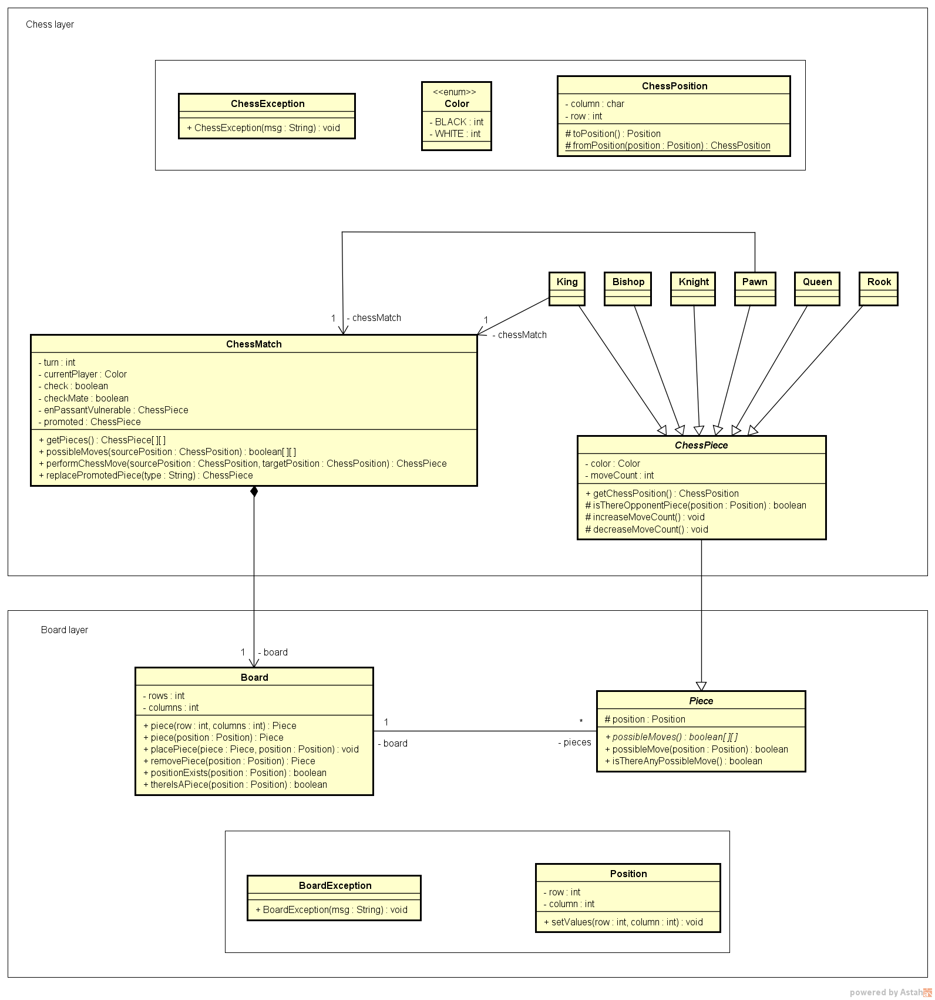

## Sistema de Xadrez em Java (Terminal)

Este projeto consiste em um **sistema de xadrez executado no terminal**, desenvolvido em **Java puro**. aplicando todos os tópico de (POO) Programação Orientada a Objetos. O sistema permite visualizar o tabuleiro, movimentar peças, validar jogadas e tratar exceções de regras do jogo.

---

## Funcionalidades

- Exibição do tabuleiro no terminal
- Movimentação de peças por coordenadas
- Validação de movimentos
- Detecção de jogadas inválidas
- Organização por camadas (application, chess, boardlayer)

---

## Estrutura do Projeto

```
src
 ├── application
 │    ├── App.java
 │    └── UI.java
 ├── chess
 │    ├── ChessMatch.java
 │    ├── ChessPiece.java
 │    ├── ChessPosition.java
 │    ├── ChessException.java
 │    └── Color.java
 └── boardlayer
      ├── Board.java
      ├── Piece.java
      ├── Position.java
      └── BoardException.java
```

---

## Requisitos

- Java JDK 17 ou superior
- Terminal (CMD, PowerShell ou Terminal do VS Code)

---

## Como Compilar e Executar

Abra o terminal dentro da pasta:

```
ProjetoSistemaXadrez/system
```
```
dir /s /b src\*.java > sources.txt
```
```
javac @sources.txt
```
```
java -cp src application.App
```

---


## Diagrama de Classes

O projeto utiliza um diagrama de classes para representar as relações entre as entidades principais.

---



---

-

