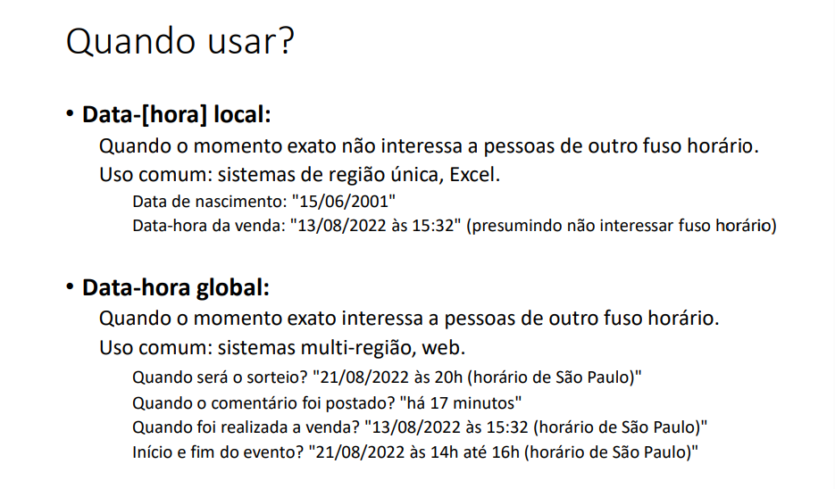

## Trabalhando com data-hora
- Data-[hora] local: ano-mês-dia-[hora] sem fuso horário [hora] opcional 
- Data-hora global: ano-mês-dia-hora com fuso horário
- Duração: tempo decorrido entre duas data-horas

---
## Uso:


---

## Timezone (fuso horário) 
> GMT - Greenwich Mean Time
• Horário de Londres
• Horário do padrão UTC - Coordinated Universal Time
• Também chamado de "Z" time, ou Zulu time

> Outros fuso horários são relativos ao GMT/UTC: 
• São Paulo: GMT-3
• Manaus: GMT-4
• Portugal: GMT+1
- - diferença de horas: MENOS 3 HORAS = -3.
> Muitas linguagens/tecnologias usam nomes para as timezones: 
• "US/Pacific"
• "America/Sao_Paulo"
• etc.

## Padrão ISO 8601: representação em texto
- Data-[hora] **local**:
> 2022-07-21
> 2022-07-21T14:52
> 2022-07-22T14:52:09
> 2022-07-22T14:52:09.4073

- Data-hora **global**:
> 2022-07-23T14:52:09Z
> 2022-07-23T14:52:09.254935Z
> 2022-07-23T14:52:09-03:00

* SEPARAÇÃO POR T e .
* x indica global Londres

## Operações: Instanciação e Formatação de Data e Hora em Java

## Instanciação
Usamos a API `java.time` (Java 8+), que é moderna e imutável.

```java
import java.time.LocalDate;
import java.time.LocalTime;
import java.time.LocalDateTime;

LocalDate data = LocalDate.now();         // Apenas data
LocalTime hora = LocalTime.now();         // Apenas hora
LocalDateTime dataHora = LocalDateTime.now(); // Data e hora
```

## Formatação

Utilizamos `DateTimeFormatter` para definir o formato.

```java
import java.time.format.DateTimeFormatter;

DateTimeFormatter formato = DateTimeFormatter.ofPattern("dd/MM/yyyy HH:mm:ss");
String formatado = dataHora.format(formato);

System.out.println(formatado); // Exemplo: 11/08/2025 19:45:30
```

# Operações Importantes com Data-Hora em Java

## 1. Converter Data-Hora Global para Local
Transforma `Instant` (data-hora UTC) em `LocalDateTime` no fuso horário do sistema ou outro desejado.

```java
import java.time.*;

Instant agoraUtc = Instant.now();
LocalDateTime local = LocalDateTime.ofInstant(agoraUtc, ZoneId.systemDefault());
```

---

## 2. Obter Dados de uma Data-Hora Local

Extrair partes específicas como dia, mês, ano, hora, etc.

```java
LocalDateTime dataHora = LocalDateTime.now();

int dia = dataHora.getDayOfMonth();
int mes = dataHora.getMonthValue();
int ano = dataHora.getYear();
int hora = dataHora.getHour();
```

---

## 3. Cálculos com Data-Hora

### Adicionar ou subtrair tempo

```java
LocalDateTime daquiUmaSemana = dataHora.plusDays(7);
LocalDateTime semanaPassada = dataHora.minusWeeks(1);
```

### Calcular duração entre duas datas-horas

```java
LocalDateTime inicio = LocalDateTime.of(2025, 8, 1, 10, 0);
LocalDateTime fim = LocalDateTime.of(2025, 8, 11, 19, 0);

Duration duracao = Duration.between(inicio, fim);
System.out.println(duracao.toDays()); // Dias de diferença
```

---

## Tipos:
> Data-hora local
- LocalDate
- LocalDateTime
> Data-hora global
- Instant 
> Duração
- Duration
> Outros
- ZoneId
- ChronoUnit

## Formatação
- Padrão ISO 8601 e classe Instant
- Formato: yyyy-MM-ddTHH:mm:ssZ
- Exemplo: "2018-06-25T15:42:07Z"
- ``Date y3 = Date.from(Instant.parse("2018-06-25T15:42:07Z"));``

## SimpleDateFormat:
- dd/MM/yyyy -> 23/07/2018
- dd/MM/yyyy HH:mm:ss -> 23/07/2018 15:42:07


````java
SimpleDateFormat sdf1 = new SimpleDateFormat("dd/MM/yyyy");
SimpleDateFormat sdf2 = new SimpleDateFormat("dd/MM/yyyy HH:mm:ss");
SimpleDateFormat sdf3 = new SimpleDateFormat("dd/MM/yyyy HH:mm:ss");
sdf3.setTimeZone(TimeZone.getTimeZone("GMT"));
Date x1 = new Date();
Date x2 = new Date(System.currentTimeMillis());
Date x3 = new Date(0L);
Date x4 = new Date(1000L * 60L * 60L * 5L);
Date y1 = sdf1.parse("25/06/2018");
Date y2 = sdf2.parse("25/06/2018 15:42:07");
Date y3 = Date.from(Instant.parse("2018-06-25T15:42:07Z"));
System.out.println("x1: " + x1);
System.out.println("x2: " + x2);
System.out.println("x3: " + x3);
System.out.println("x4: " + x4);
System.out.println("y1: " + y1);
System.out.println("y2: " + y2);
System.out.println("y3: " + y3);
System.out.println("-------------");
System.out.println("x1: " + sdf2.format(x1));
System.out.println("x2: " + sdf2.format(x2));
System.out.println("x3: " + sdf2.format(x3));
System.out.println("x4: " + sdf2.format(x4));
System.out.println("y1: " + sdf2.format(y1));
System.out.println("y2: " + sdf2.format(y2));
System.out.println("y3: " + sdf2.format(y3));
System.out.println("-------------");
System.out.println("x1: " + sdf3.format(x1));
System.out.println("x2: " + sdf3.format(x2));
System.out.println("x3: " + sdf3.format(x3));
System.out.println("x4: " + sdf3.format(x4));
System.out.println("y1: " + sdf3.format(y1));
System.out.println("y2: " + sdf3.format(y2));
System.out.println("y3: " + sdf3.format(y3));
````