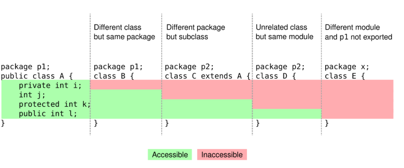

##  1. Escopo 
- O **escopo** define **onde uma variável ou campo pode ser acessado** dentro do código.
- Regras do escopo:
> **"O escopo dos campos e variáveis dentro de uma classe determina a sua visibilidade."**

### Tipos de escopo:

#### 1.1 Escopo de Variáveis Locais (dentro de métodos):
* Só existem **durante a execução do método**.
* Declaradas dentro de blocos `{ ... }`.
* **Devem ser declaradas antes do uso.**

```java
public class Exemplo {
    public void metodo() {
        int numero = 10; // escopo local
        System.out.println(numero);
    }
}
```

- A variável `numero` **só existe dentro do método `metodo()`**.

---

#### 1.2 Escopo de Atributos (variáveis da classe):
> **"Os atributos da classe são visíveis por toda a classe."**
* Acessíveis em qualquer parte da classe.
* Podem ser usados em vários métodos.
* Mesmo se declarados no fim da classe, **serão visíveis para toda ela.**

```java
public class Pessoa {
    private String nome; // atributo com escopo da classe inteira

    public void setNome(String novoNome) {
        nome = novoNome;
    }

    public String getNome() {
        return nome;
    }
}
```

---

## 2. Encapsulamento
> **"Encapsular é proteger os dados internos da classe e controlar o acesso a eles."**
* **Proteger os dados** da classe.
* **Controlar o acesso** a atributos e métodos.
* **Evitar que usuários modifiquem valores diretamente** e causem erros.

- Exemplo ruim (sem encapsulamento):

```java
public class Data {
    public int dia;
    public int mes;
    public int ano;
}
```

- Com isso, alguém pode fazer:

```java
Data d = new Data();
d.dia = 40; // ❌ Data inválida!
```

- Exemplo com **encapsulamento correto**:

```java
public class Data {
    private int dia;
    private int mes;
    private int ano;

    public void setData(int d, int m, int a) {
        if (d >= 1 && d <= 31 && m >= 1 && m <= 12 && a > 0) {
            dia = d;
            mes = m;
            ano = a;
        } else {
            System.out.println("Data inválida!");
        }
    }

    public String getData() {
        return dia + "/" + mes + "/" + ano;
    }
}
```
- Agora o usuário **não pode modificar diretamente os atributos**, apenas através dos métodos `setData` e `getData`.

---

## 3. Modificadores de acesso
> **"Permitem a restrição ao acesso a campos e métodos em classes."**
São palavras-chave usadas para controlar **quem pode acessar** os campos ou métodos.

- Sintaxe:
```java
modificador-de-acesso tipo nome-do-campo;
modificador-de-acesso tipo-de-retorno nome-do-metodo(argumentos);
```

---

### Existem 3 modificadores de acesso principais:

| Modificador | Acesso permitido por:                                     | Exemplo na prática                     |
| ----------- | --------------------------------------------------------- | -------------------------------------- |
| `public`    | Qualquer classe                                           | `public int getId()`                   |
| `private`   | Somente a **mesma classe**                                | `private int idade;`                   |
| `protected` | Mesma classe **e subclasses (herança)**                   | `protected void ajustar()`             |

- protected: Permite acesso a subclasses, mesmo que estejam em pacotes diferentes.

---


---