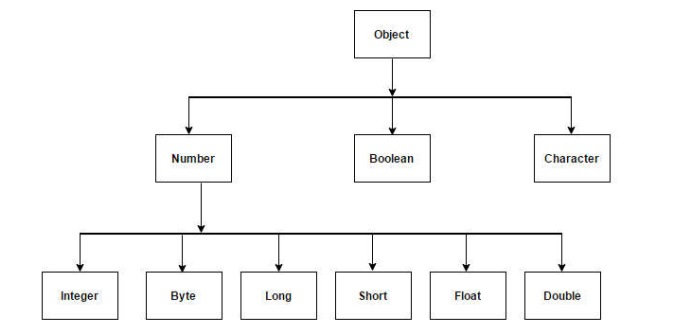

## Tipos curinga (wildcard types)
- O supertipo de qualquer tipo de lista é List<?>. Este é um tipo curinga:

``` java
// List<Object> não é o supertipo de qualquer tipo de lista:
List<Object> myObjs = new ArrayList<Object>();
List<Integer> myNumbers = new ArrayList<Integer>();
myObjs = myNumbers; // erro de compilação

// O supertipo de qualquer tipo de lista é List<?>. Este é um tipo curinga:

List<?> myObjs = new ArrayList<Object>();
List<Integer> myNumbers = new ArrayList<Integer>();
myObjs = myNumbers;

```

> Com tipos curinga podemos fazer métodos que recebem um genérico de "qualquer tipo":

```java
package application;
import java.util.Arrays;
import java.util.List;
public class Program {
public static void main(String[] args) {
List<Integer> myInts = Arrays.asList(5, 2, 10);
printList(myInts);
}
public static void printList(List<?> list) {
for (Object obj : list) {
System.out.println(obj);
}
}
}
```
> Não é possível adicionar dados  a uma coleção de tipo curinga. 
> Curingas Delimitados.

###  (princípio get/put)
- Vamos fazer um método que copia os elementos de uma lista para uma outra lista que pode ser mais genérica que a primeira.

````java
List<Integer> myInts = Arrays.asList(1, 2, 3, 4);
List<Double> myDoubles = Arrays.asList(3.14, 6.28);
List<Object> myObjs = new ArrayList<Object>();
copy(myInts, myObjs);
copy(myDoubles, myObjs);
````
---


---
- Covariância
```java
List<Integer> intList = new ArrayList<Integer>();
intList.add(10);
intList.add(5);
List<? extends Number> list = intList;
Number x = list.get(0);
list.add(20); // erro de compilacao por incopatibiblidade
```
> Get = ok Put(add) = erro

- Contravariância
```java
List<Object> myObjs = new ArrayList<Object>();
myObjs.add("Maria");
myObjs.add("Alex");
List<? super Number> myNums = myObjs;
myNums.add(10);
myNums.add(3.14);
Number x = myNums.get(0); // erro de compilacao
```
> Get = error Put(add) = ok