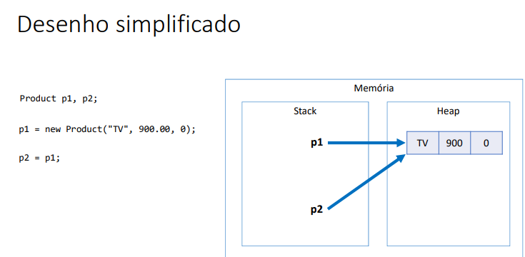
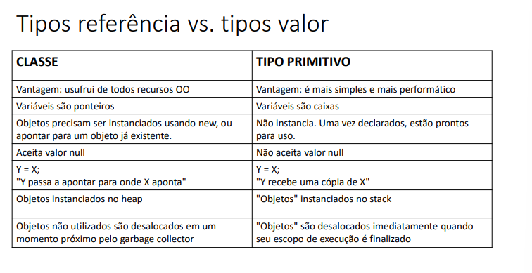
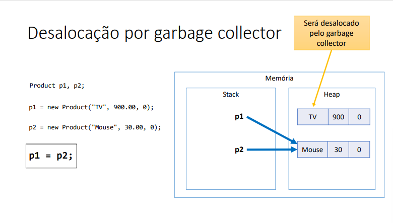

## Classes são tipos referência
- Variáveis cujo tipo são classes não devem ser entendidas como caixas, mas sim “tentáculos” (ponteiros) para caixas.

---

---

### Valor null
- Tipos referência aceitam o valor "null", que indica que a variável aponta pra ninguém.

## Tipos primitivos são tipos valor
- Variáveis cujo tipo são primitivos devem ser entendidas como caixas que guardam valores.
> initialização de variáveis primitivos com valor padrão ou atribuição.

---

---

## Garbage collector
- É um processo que automatiza o gerenciamento de memória de um
programa em execução do heap (dinâmica).
- O garbage collector monitora os objetos alocados dinamicamente pelo programa (no heap), desalocando aqueles que não estão mais sendo utilizados.
> Questões de escopo locale subescopo.
> Escopo de uma estrutura terminou as váriavies declaradas nele são desalocadas.
---

---
## Boxing:
- O processo de conversão de um tipo primitivo para o seu correspondente tipo referência é chamado boxing (empacotamento).

