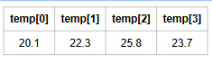

## Arrays e ArrayLists - [Vetores]
> Homogênea (dados do mesmo tipo).
> Ordenada (elementos acessados por meio de posições).
> Alocada de uma vez só, em um bloco contíguo de memória.
> Acesso imediato aos elementos pela sua posição.


---

### Array

- Arrays são estruturas de dados que permitem o armazenamento de um conjunto de variáveis de um mesmo tipo ou instâncias de uma mesma classe usando uma única referência e um índice de acesso.  

- Cada um dos elementos do array pode ser acessado individualmente.  
- O array inteiro pode ser processado como uma única entidade, caso seja desejado, simplificando bastante algumas tarefas.

---


---

### Array unidimensionais

- **Declaração:**

```java
tipo[] nomeDaReferencia;
tipo nomeDaReferencia[];
```

**Exemplos:**

```java
char[] letrasDoAlfabeto;
double medidasDeTemperatura[];
```

- Não basta somente declarar as referências a arrays, estas devem ser **inicializadas**.

- Um array deve ser inicializado com a palavra-chave `new`, seguida do tipo de dado a ser alocado e do número de elementos a alocar, entre colchetes:

```java
int[] posicoesDeMemoria = new int[1024];
int quantidadeNecessaria = 32768;
byte[] vetorNumerico = new byte[quantidadeNecessaria];
char[] letrasDoAlfabeto = {
  'a','b','c','d','e','f','g','h','i','j','k','l','m',
  'n','o','p','q','r','s','t','u','v','w','x','y','z'
};
double[] medidasDeTemperatura;
medidasDeTemperatura = new double[24 * 60 * 60];
double[] duplicata = medidasDeTemperatura;
```

- Após a inicialização, podemos acessar seus elementos usando o nome da referência seguido do índice do elemento entre colchetes.
- O primeiro índice é o **zero**.
> todos os campos do array inicialmente estão com valor padrão 0 ou 0.0. ou etc.

```java
int[] posicoesDeMemoria = new int[1024];
System.out.println(posicoesDeMemoria[0]);      // correto
System.out.println(posicoesDeMemoria[1023]);   // correto

System.out.println(posicoesDeMemoria[-1]);     // errado
System.out.println(posicoesDeMemoria[1024]);   // errado
System.out.println(posicoesDeMemoria[5.4]);    // errado
```

- Um array, depois de inicializado, **não pode ter seu tamanho modificado**.
- Porém, é possível usar a referência para apontar para outro array:

```java
boolean[] respostas = new boolean[12];
respostas = new boolean[144];
```

- Os valores do primeiro array (de 12 posições) serão **perdidos** quando a referência apontar para o array de 144 posições.

- Quando arrays de tipos nativos são inicializados, os elementos automaticamente recebem **valores default**.

- Os elementos de um array inicializado podem ser utilizados como **variáveis independentes**:

```java
medidasDeTemperatura[5] = 45.8;
```

- Geralmente, um array será populado com um laço cuja variável de controle cobre os valores aceitáveis para índices do array, modificando o elemento naquele índice.
Em Java, Arrays unidimensionais possuem um atributo `length` que armazena a sua quantidade de elementos:

```java
int[] naturais = new int[11];
for (int i = 0; i < naturais.length; i++) {
  naturais[i] = i;
  System.out.println("naturais[" + i + "] = " + naturais[i]);
}
```


## Arrays de instâncias de classes

- Podem ser declaradas de forma similar à arrays de valores de tipos nativos.  

- A diferença principal é que a inicialização dos elementos do array deve ser feita através da palavra-chave `new` e da chamada ao construtor da classe.

```java
Funcionario[] equipe = new Funcionario[5];
equipe[2] = new Funcionario("Davi Matias", 876451, 27, 12, 1940, 38200f);
// Um new para cada um. Uso de Laço.
```

---

## Passando array para métodos

- Para passar um argumento de array para um método, especifique o nome do array **sem nenhum colchete**:

```java
double[] temperaturaHora = new double[24];
modificaArray(temperaturaHora);
```

- Para um método receber uma referência de array, a lista de parâmetros do método deve especificar um parâmetro de array incluindo tipo, colchetes e nome do parâmetro:

```java
void modificaArray(double[] b)
```


