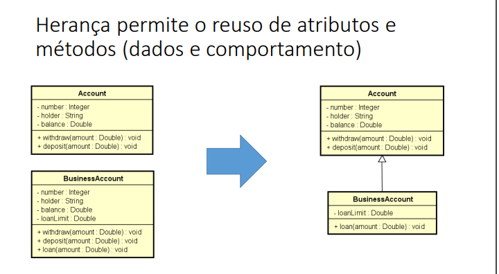

## A ideia de Herança
- Nem sempre o mecanismo de delegação é o mais natural para reutilização de classes já existentes.  
- Em especial, quando queremos usar uma classe para servir de base à criação de outra mais especializada.  

---


---
- O mecanismo de **herança** permite que criemos uma classe usando outra como base.  
- Deve-se descrever na nova classe as **diferenças** da classe base  
- Reutiliza os **atributos e métodos** da classe base  
- Instâncias da subclasse podem chamar métodos e acessar atributos (herdados) diretamente, como se fossem delas mesmas  
- É o mais apropriado para criar relações "**é-um-tipo-de**" entre classes  
 
---
## No uml:



---


### Sintaxe - Uso do `extends`:

```java
class Programador extends Funcionario {
    // novos campos e métodos
}
```

### A palavra `super`
- A palavra `super` é usada para referenciar a classe base de uma subclasse.
- É usada para chamar o construtor da classe base ou acessar métodos e campos da classe base.
```java


class Funcionario {
    String nome;
    double salario;

    Funcionario(String nome, double salario) {
        this.nome = nome;
        this.salario = salario;
    }

    void informarSalario(double valor) {
        this.salario = valor;
    }

    double obterSalario() {
        return this.salario;
    }
}

class Programador extends Funcionario {
    String linguagem;

    Programador(String nome, double salario, String linguagem) {
        super(nome, salario); // Chama o construtor da classe base Funcionario
        this.linguagem = linguagem;
    }

    void informarLinguagem(String nome) {
        this.linguagem = nome;
    }
}
```

- Útil para aumentar a reutilização de código.

- Refere-se à classe ancestral imediata.

- Similar à palavra-chave this.

- Permite que classes derivadas tenham acesso a métodos da superclasse.

- Construtores são chamados pela palavra-chave super.

#### Sintaxe
```java
super(parametros); 
super.nomeDoMetodo();
super.atributo;
```

````java
public class Ponto2D {
    private double x;
    private double y;
    
    public Ponto2D(double x, double y) {
        this.x = x;
        this.y = y;
    }
    
    public Ponto2D() {
        this.x = 0.0;
        this.y = 0.0;
    }

    public String toString() {
        return "x=" + x + ", y=" + y;
    }        
}

public class Ponto3D extends Ponto2D {
    private double z;

    public Ponto3D(double x, double y, double z) {
        super(x, y); // chamada do construtor da superclasse
        this.z = z;
    }

    public Ponto3D() {
        super();     // chamada implícita ao construtor padrão da superclasse
        this.z = 0.0;
    }

    public String toString() {
        return super.toString() + ", z=" + z; // chamada ao método toString da superclasse
    }    
}
````


### Regras importantes
- Construtores de superclasses só podem ser chamados dentro de construtores de subclasses
- *A chamada super(...) precisa estar na primeira linha do construtor*
- *O construtor de uma subclasse sempre chama o construtor de sua superclasse, mesmo que a chamada não seja explícita.*


### Métodos herdados
- os métodos da superclasse podem ser chamados diretamente na subclasse, sem a necessidade de usar a palavra `super`.
```java
super.nomeDoMetodo(par1, ..., parN);
```

### Sobreposição (Override)
- A declaração de métodos com a mesma assinatura que métodos das classes ancestrais é chamada de sobreposição (ou superposição).

- A razão de sobrepormos métodos é que métodos de classes herdeiras geralmente executam tarefas adicionais que os mesmos métodos das classes ancestrais não executam.

- Usamos o modificador `@Override` para:
- Indicar que um método está sendo sobrescrito (ou seja, redefinido) de uma superclasse (classe pai) em uma subclasse (classe filha).

- Comportamento especifico.
```java
@Override
public void nomeDoMetodo() {
    // implementação do método
}
```

## Casting é o processo de conversão de um tipo de dado para outro

### Upcasting
- Casting da subclasse para superclasse
- Uso comum: polimorfismo

### Downcasting
- Casting da superclasse para subclasse
- Palavra instanceof
- Uso comum: métodos que recebem parâmetros genéricos (ex: Equals)


### Operador `instanceof`

- O operador `instanceof` verifica se um objeto é uma instância de uma classe específica ou de suas subclasses.
- Retorna `true` se o objeto for do tipo especificado, caso contrário retorna `false`.

Exemplo:
```java
if (empregado instanceof Empregado) {
        // empregado é uma instância de Empregado ou de uma subclasse
}
```

**Resumo:**  
- Use `final` para impedir modificações, sobrescritas ou heranças.
- Use `instanceof` para checar o tipo de um objeto em tempo de execução.
