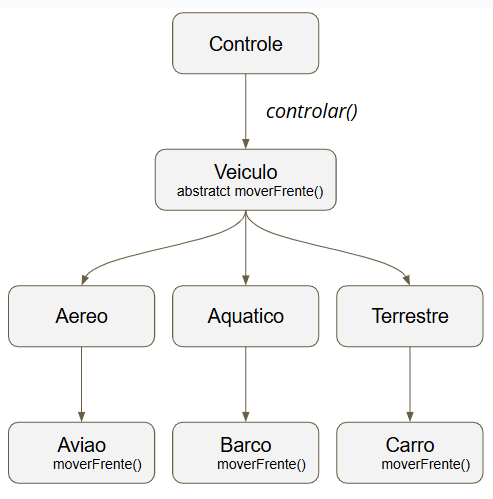

### 0.1 Polimorfismo de inclusão
- O Polimorfismo de Inclusão é o termo formal para o que, na prática, conhecemos como *Polimorfismo de Sobrescrita* (Override). 

- A ideia central é a capacidade de um objeto de uma subclasse ser tratado (ou "incluído") como se fosse um objeto da sua superclasse, mas ainda assim executar o comportamento específico da sua própria classe.

> Polimorfismo de Inclusão é simplesmente tratar objetos diferentes como se fossem iguais (usando o tipo da classe pai), e deixar que cada um se comporte do seu jeito único (executando o método da classe filha).


- A classse pai busca o método na subclasse, e se ele existir, a versão da subclasse é executada. Ele vai procurando o método na hierarquia de classes, começando pela subclasse e subindo até a superclasse.
---


---
### Sintaxe e Requisitos

1.  **Herança:** É necessário ter uma relação de herança (`extends` ou `implements`).
2.  **Mesma Assinatura:** O método na subclasse deve ter a **mesma assinatura** (mesmo nome, mesmos tipos e quantidade de parâmetros) do método na superclasse.
3.  **Anotação `@Override`:** É uma boa prática usar a anotação `@Override` para que o compilador verifique se você está realmente sobrescrevendo um método e não criando um novo por engano.

### Exemplo
**Arquivo: `FiguraGeometrica.java` (A Superclasse)**

```java
// A classe pai define um método genérico.
public class FiguraGeometrica {

    public void desenhar() {
        System.out.println("Desenhando uma figura geométrica genérica.");
    }
}
```

**Arquivo: `Circulo.java` (A Subclasse)**

```java
// Circulo É UMA FiguraGeometrica
public class Circulo extends FiguraGeometrica {

    // A subclasse SOBRESCREVE o comportamento do método desenhar.
    @Override
    public void desenhar() {
        System.out.println("Desenhando um CÍRCULO: ○");
    }
}
```

**Arquivo: `Quadrado.java` (Outra Subclasse)**

```java
// Quadrado É UMA FiguraGeometrica
public class Quadrado extends FiguraGeometrica {

    // A subclasse também SOBRESCREVE o método, mas com seu próprio comportamento.
    @Override
    public void desenhar() {
        System.out.println("Desenhando um QUADRADO: □");
    }
}
```

**Arquivo: `Principal.java` (Onde a mágica acontece)**

```java
public class Principal {
    public static void main(String[] args) {
        // Criamos objetos dos tipos específicos...
        FiguraGeometrica fig1 = new Circulo();
        FiguraGeometrica fig2 = new Quadrado();

        // ...mas nos referimos a eles como FiguraGeometrica (o tipo genérico).
        // A mesma chamada de método...
        System.out.print("A figura 1 desenha assim: ");
        fig1.desenhar(); // ...chama o método do Círculo!

        System.out.print("A figura 2 desenha assim: ");
        fig2.desenhar(); // ...chama o método do Quadrado!
    }
}
```

- A JVM, em tempo de execução, verifica qual é o tipo real do objeto (`Circulo` ou `Quadrado`) e chama a versão correta do método `desenhar()`.


## Na assinatura do método:
> 0.1 Na chamada do construtor da classe Desenho (O Momento da Inclusão).

```java
public Desenho(FiguraGeometrica fig1, int coordX1, int coordY1, FiguraGeometrica fig2, int coordX2, int coordY2) { ... }
```
- O construtor não pede um Circulo ou um Quadrado específicos. Ele pede duas FiguraGeometrica genéricas. O tipo FiguraGeometrica aqui funciona como um "espaço" ou uma "vaga" que pode ser preenchida por qualquer objeto que seja seu filho.


> 0.2 Na execução do método apresenta() (A Consequência da Inclusão).
- Aqui está a inclusão:
- Um objeto Circulo para o parâmetro fig1, que esperava uma FiguraGeometrica.
- Um objeto Quadrado para o parâmetro fig2, que esperava uma FiguraGeometrica.
```java
// Para o desenho1
Desenho desenho1 = new Desenho(meuCirculo, 10, 20, meuQuadrado1, 50, 60);

// Para o desenho2
Desenho desenho2 = new Desenho(meuQuadrado2, 100, 110, meuTriangulo, 150, 160);

figura1.apresenta();
figura2.apresenta();

```