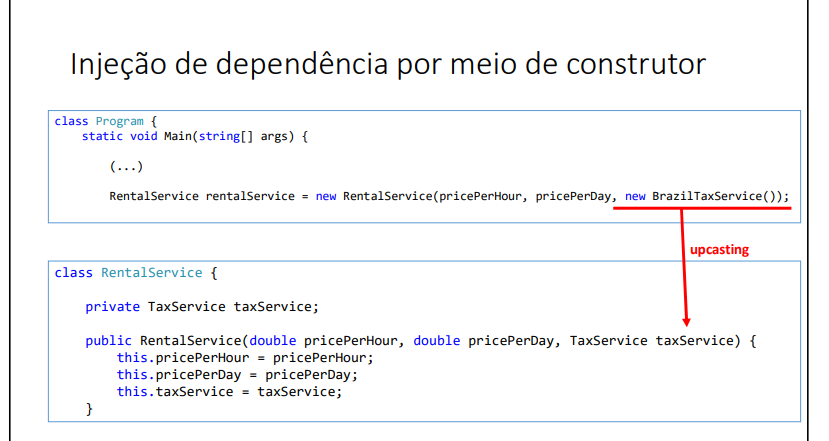

## Interface
- Interface é um tipo que define um conjunto de operações que umaclasse deve implementar.
-  A interface estabelece um contrato
que a classe deve cumprir.
> No uml é a seta: - - - - - ->
## O Conceito: O que é uma Interface?

- É um documento que define um conjunto de **comportamentos** (métodos) que uma classe se compromete a executar, mas não diz **COMO** ela deve executá-los.

+ **Analogia: O Contrato de Trabalho**
Um contrato de trabalho pode listar as obrigações de um funcionário, como `entregarRelatorioSemanal()` e `baterPonto()`. O contrato define **O QUE** deve ser feito. Como cada funcionário (um `Programador`, um `Designer`, um `Gerente`) vai realizar essas tarefas é um detalhe de implementação de cada um.

## Principais Características

  * **Totalmente Abstrata:** Tradicionalmente, todos os métodos de uma interface são `public` e `abstract` por padrão (você nem precisa escrever essas palavras).
  * **Contrato de Comportamento:** Garante que qualquer classe que a implemente terá certos métodos, estabelecendo uma capacidade. Ex: a capacidade de ser `Autenticavel`, `Imprimivel`, `Comparavel`.
  * **Não pode ser instanciada:** Você não pode criar um objeto diretamente de uma interface (`new MinhaInterface()` dará erro).
  * **Permite "Herança Múltipla":** Este é o seu superpoder\! Uma classe só pode herdar (`extends`) de UMA superclasse, mas pode implementar (`implements`) **VÁRIAS** interfaces. Isso permite que uma classe "assine múltiplos contratos" e adquira diferentes capacidades.


- Java não suporta herança múltipla (uma classe só pode herdar de uma superclasse). No entanto, isso pode ser alcançado com interfaces, porque a classe pode implementar várias interfaces.
> class CarroAnfibio implements Terrestre, Aquatico { … }

## Sintaxe

**Declarando uma Interface:**

```java
public interface NomeDaInterface {

    // Constantes (são public static final por padrão)
    String TIPO_CONTRATO = "SERVICO_GERAL";

    // Métodos (são public abstract por padrão)
    void executarTarefa();
    String getStatus(int idTarefa);
}
```

**Implementando a Interface em uma Classe:**
A classe que assina o contrato usa a palavra-chave `implements`.

```java
// A classe Robô se compromete a cumprir o contrato da interface
public class Robo implements NomeDaInterface {

    // É OBRIGATÓRIO implementar todos os métodos da interface

    @Override
    public void executarTarefa() {
        System.out.println("Robô executando a tarefa de forma automatizada.");
    }

    @Override
    public String getStatus(int idTarefa) {
        return "Tarefa " + idTarefa + " do robô está 100% concluída.";
    }
}
```

## Exemplo Prático: Veículos Voadores

Imagine que temos classes como `Carro` e `Aviao`. Um avião pode voar, um carro não. Mas e se tivermos um `Drone` ou um `Hidroaviao`? Eles também podem voar. "Ser capaz de voar" é uma **capacidade** que pode ser aplicada a vários tipos de objetos.

**1. O Contrato: `Voador.java`**

```java
// A interface define o que significa "ser capaz de voar"
public interface Voador {

    void decolar();
    void voar();
    void pousar();
}
```

**2. As Classes que Assinam o Contrato:**

**`Aviao.java`**

```java
// Aviao é um Veiculo (herança) e também é um Voador (interface)
public class Aviao extends Veiculo implements Voador {

    @Override
    public void decolar() {
        System.out.println("Avião acelerando na pista e decolando...");
    }

    @Override
    public void voar() {
        System.out.println("Avião voando em altitude de cruzeiro.");
    }

    @Override
    public void pousar() {
        System.out.println("Avião alinhando com a pista e pousando.");
    }
}
```

**`Drone.java`**

```java
// Drone não é um Veiculo no nosso modelo, é outra coisa.
// Mas ele também pode assinar o contrato de Voador.
public class Drone implements Voador {

    @Override
    public void decolar() {
        System.out.println("Drone subindo verticalmente...");
    }

    @Override
    public void voar() {
        System.out.println("Drone pairando no ar e filmando.");
    }

    @Override
    public void pousar() {
        System.out.println("Drone pousando verticalmente.");
    }
}
```

**3. O Benefício do Polimorfismo:**
Podemos criar uma "torre de controle" que lida com qualquer objeto `Voador`, não importa o que ele seja.

```java
public class TorreDeControle {
    public void autorizarVoo(Voador objetoVoador) {
        System.out.println("\n--- Autorizando voo ---");
        objetoVoador.decolar();
        objetoVoador.voar();
        objetoVoador.pousar();
        System.out.println("----------------------");
    }
}

// No método main:
TorreDeControle torre = new TorreDeControle();
Aviao meuAviao = new Aviao();
Drone meuDrone = new Drone();

torre.autorizarVoo(meuAviao); // Funciona!
torre.autorizarVoo(meuDrone); // Funciona também!
```

## Tabela Comparativa: Interface vs. Classe Abstrata

| Característica | Interface | Classe Abstrata |
| :--- | :--- | :--- |
| **Propósito**| Definir um **contrato de comportamento**. | Fornecer um **esqueleto base comum**. |
| **Herança Múltipla**| **Sim**, uma classe pode `implements` várias.| **Não**, uma classe só pode `extends` uma. |
| **Atributos** | Apenas constantes (`static final`). | Pode ter atributos de instância (`private`, etc).|
| **Métodos** | Geralmente todos abstratos. | Pode ter métodos abstratos e concretos. |
| **Palavra-chave** | `implements` | `extends` |
| **Relação** | "É capaz de..." (um `Aviao` é capaz de `Voador`).| "É um..." (um `Aviao` é um `Veiculo`). |

----

---- 