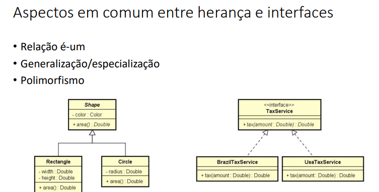
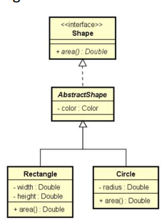

### **Inversão de Controle (IoC)**

* Normalmente, uma classe cria e gerencia seus próprios objetos que ela precisa.
* **IoC** inverte isso: a classe **não cria mais suas dependências**, alguém de fora que fornece (ou injeta) o que ela precisa.
* Objetivo: deixar a classe mais **flexível**, desacoplada e fácil de testar.

### **Exemplo resumido**

```java
class Engine {
    void start() { System.out.println("Engine started"); }
}

class Car {
    private Engine engine;

    // Ao invés de criar Engine aqui, recebemos de fora
    public Car(Engine engine) {
        this.engine = engine;
    }

    void drive() {
        engine.start();
        System.out.println("Car is driving");
    }
}

// Fora da classe Car:
Engine engine = new Engine();
Car car = new Car(engine); // injetando a dependência
```

### **Injeção de Dependência (DI)**

* É a **maneira prática de aplicar IoC**.
* Pode ser **por construtor** (como acima), **por setter** ou **por framework** (Spring, CDI, etc.).
* Permite trocar a implementação da dependência sem mudar a classe que a usa.


## Herdar vs. cumprir contrato


---
> Herança: reuso
> Interface: contrato a ser comprido

> Implementação de ambos
---


---