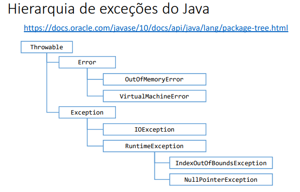

## Exceções
- Uma exceção indica um problema que ocorre quando um programa é executado.  
- Alguns problemas podem evitar que um programa continue executando.  
- Exemplos: índice de array inválido, tipo de dado de entrada incorreto, divisão por zero...  
  
- O tratamento de exceção ajuda a criar programas tolerantes a falhas.  
- Em muitos casos, isso permite que um programa continue a executar como se nenhum problema tivesse ocorrido.

## A instrução try … catch

**Sintaxe:**

```java
try {
  // código que pode lançar exceções
} catch (ExcecaoA a) {
  // código que trata a exceção ExcecaoA
}
```

+ Para lidar com uma exceção, coloque qualquer código que possa lançar uma exceção em uma instrução try.
+ O bloco try contém o código que pode lançar uma exceção.
+ O bloco catch contém o código que trata a exceção se uma ocorrer.

## Hierarquia de exceções

---


---
- Todas as classes de exceção do Java herdam direta ou indiretamente da classe Exception.
- Somente objetos Throwable podem ser utilizados com o mecanismo de tratamento de exceção.
- Exceptions representam situações excepcionais que podem ser capturadas pelo aplicativo.
- A classe Error e suas subclasses representam situações anormais; geralmente os aplicativos não podem se recuperar de Errors.

## A instrução try … catch (blocos múltiplos)
> Podem haver muitos blocos catch para tratar diferentes tipos de exceções que podem ser lançadas no bloco try correspondente.
> Podemos englobar todas as exceções com `Exception`:

```java
try {
  // código que pode lançar exceções
} catch (ExcecaoA a) {
  // código que trata a exceção ExcecaoA
} /* … */ {
  // ...
} catch (ExcecaoN n) {
  // código que trata a exceção ExcecaoN
}
```

## Multi catch

- É comum que um bloco try seja seguido por vários blocos catch para tratar vários tipos de exceção.
Se os corpos dos vários blocos catch forem idênticos, use o recurso multi-catch:

```java
catch (Tipo1 | Tipo2 | Tipo3 e) {
  // tratamento comum
}
```

## finally

* É executado independentemente de uma exceção ser lançada ou não.
* Se estiver presente, ele é colocado depois do último bloco catch.

```java
try {
  // código que pode lançar exceções
} catch (ExcecaoA a) {
  // código que trata a exceção ExcecaoA
} /* … */ {
  // ...
} finally {
  // código que será executado
  // independente de haver exceção
}
```

## Rastreamento de pilha

* Informações exibidas quando uma exceção é lançada.
* Inclui:

  * o nome da exceção (ex: `java.lang.ArithmeticException`) em uma mensagem descritiva que indica o problema que ocorreu;
  * a pilha de chamadas de método no momento em que a exceção ocorreu.
* Ajuda a depurar o programa.

Exemplo de rastreamento:

```
Exception in thread "main" java.lang.ArithmeticException: / by zero

at DivideByZeroNoExceptionHandling.quotient(
DivideByZeroNoExceptionHandling.java:10)

at DivideByZeroNoExceptionHandling.main(
DivideByZeroNoExceptionHandling.java:22)
```

## Clause throws

* Especifica as exceções que o método pode lançar se ocorrerem problemas.
* Deve aparecer após a lista de parâmetros e antes do corpo do método.
* Exemplo:

```java
public static int divisao(int numerador, int denominador) throws ArithmeticException

```
- Os chamadores do método `divisao` são assim informados de que o método pode lançar uma exceção.

## exceção.printStackTrace():
- Este método, quando chamado em uma exceção, imprime no console uma representação legível do rastreamento da pilha. 
> Fluxo de erro padrão:
> Basicamente serve para impressão detahada do erro
