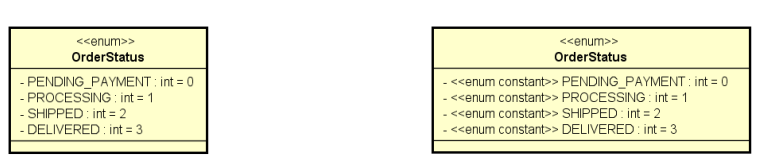

## Enumerações
- É um tipo especial que serve para especificar de forma literal um conjunto de constantes relacionadas.
- Palavra chave em Java: enum.
- Vantagem: melhor semântica, código mais legível e auxiliado pelo compilador.

> Ex: estados de um processo || Ciclo de vida de um pedido. 

- Sintaxe-exemplo: 
``` java
public enum OrderStatus {
PENDING_PAYMENT,
PROCESSING,
SHIPPED,
DELIVERED;
}

package entities;
import java.util.Date;
import entities.enums.OrderStatus;
public class Order {
private Integer id;
private Date moment;
private OrderStatus status;
(...)
```

## Conversão de String para enum
- OrderStatus os1 = OrderStatus.DELIVERED;
- OrderStatus os2 = OrderStatus.valueOf("DELIVERED");


## NOTAÇÃO uml:

---


---


## Composição:
- *É um tipo de associação que permite que um objeto contenha outro*
- **Relação "tem-um" ou "tem-vários"**
> Vantagens
- Organização: divisão de responsabilidades
- Coesão: responsabilidade.
- Flexibilidade
- Reuso
- Nota: embora o símbolo UML para composição (todo-parte) seja o diamante preto, neste contexto estamos chamando de composição qualquer associação tipo "tem-um" e "tem-vários".