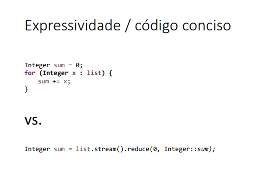

## PROGRAMAÇÃO FUNCINAL
> Expressões em forma de funções.
> expressões ("o quê" - declarativa)
> Uma função possui transparência referencial se seu resultado for sempre o mesmo para os mesmos dados de entrada. 
> (PRIMEIRA CLASSE )Uma função mandada como argumento em outra.
> A programção funvional resume codigos em uma linha.

---


---

##  **Lambda**
* Lambda é uma forma **compacta de escrever métodos anônimos** (sem nome) em Java.
> (PRIMEIRA CLASSE )Uma função mandada como argumento em outra.
* Serve principalmente para **interfaces funcionais** (interfaces com **um único método abstrato**), como `Comparator`, etc.
> Em muitas vezes usamos `::`.
- Sintaxe

```java
(parâmetros) -> expressão
```

ou

```java
(parâmetros) -> { 
    // bloco de código
    return valor; 
}
```

* Se **apenas uma expressão**, não precisa de `{}` nem `return`.
* Se **mais de uma linha**, use `{}` e `return` quando necessário.
* Tipos dos parâmetros podem ser omitidos se forem inferidos pelo compilador.

---

### a) Lambda com **uma linha** (mais comum)

```java
Comparator<Pessoa> porNome = (p1, p2) -> p1.getNome().compareTo(p2.getNome());
listaPessoas.sort(porNome);
```

### b) Lambda com **bloco de código**

```java
Comparator<Pessoa> porIdade = (p1, p2) -> {
    if (p1.getIdade() > p2.getIdade()) return 1;
    else if (p1.getIdade() < p2.getIdade()) return -1;
    else return 0;
};
listaPessoas.sort(porIdade);
```

### c) Lambda **direto no método** (sem criar variável)

```java
listaPessoas.sort((p1, p2) -> p1.getNome().compareTo(p2.getNome()));
```

---

## Interface funcional:
- (interfaces com **um único método abstrato**), como `Comparator`, etc.
- Suas implementações serão tratadas como expressões lambda.
````java
public class MyComparator implements Comparator<Product> {
@Override
public int compare(Product p1, Product p2) {
return p1.getName().toUpperCase().compareTo(p2.getName().toUpperCase());
}
}
public static void main(String[] args) {
(...)
list.sort(new MyComparator());
````

> Predicate:
- removerIf e usa-se o implements 
```java
public interface Predicate<T> {
    boolean test (T t);
}
```


> Fuction:
- A função "map" (não confunda com a estrutura de dados Map) é uma
função que aplica uma função a todos elementos de uma stream.
``` java
public interface Function<T, R> {
R apply(T t);
}
```

> A ideia é evitar funções/métodos com muitas alterações, devido a uma condicional nelas.


> Consumer:
- Usado no forEach
``` java
public interface Consumer<T> {
void accept(T t);
}
```
### Criando funções que recebem funções como argumento

``` java
removeIf(Predicate)
foreach(Consumer)
map(Function)
```

## os ::
- Serve para referenciar métodos ou construtores sem executá-los.
- Exemplo de referência a um método estático:
``` java
list.sort(String::compareToIgnoreCase);
```
- Exemplo de referência a um método de instância de um objeto específico:
``` java
list.forEach(System.out::println);
```
