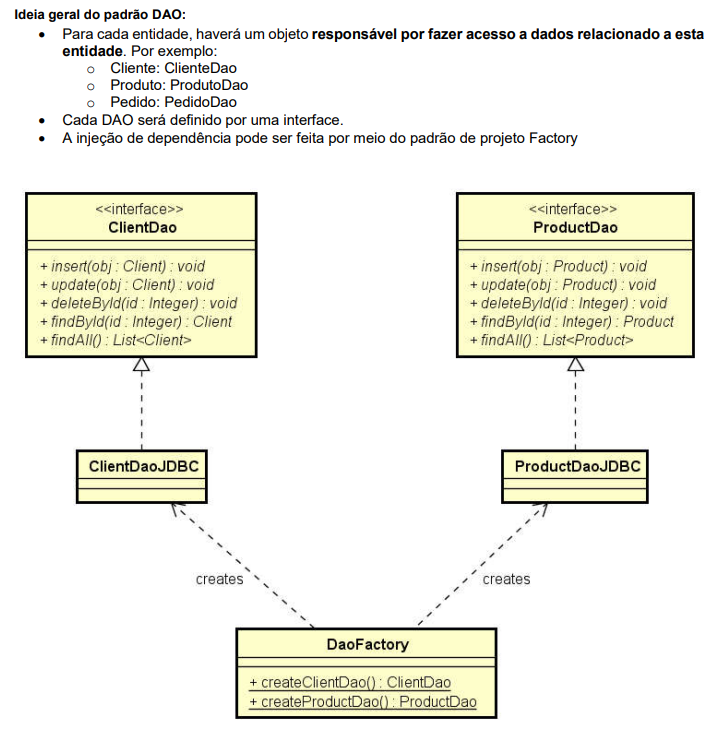

## Padrão de projeto DAO (Data Access Object)
- Para cada entidade, haverá um objeto responsável por fazer acesso a dados relacionado a esta entidade. 
+ Por exemplo:
- Cliente: ClienteDao
- Produto: ProdutoDao
- Pedido: PedidoDao
> INSERÇÃO, ALTERAÇÃO, EXCLUSÃO, CONSULTA E LISTAGEM
- Cada DAO será definido por uma interface.
- A injeção de dependência pode ser feita por meio do padrão de projeto Factory.

---

---