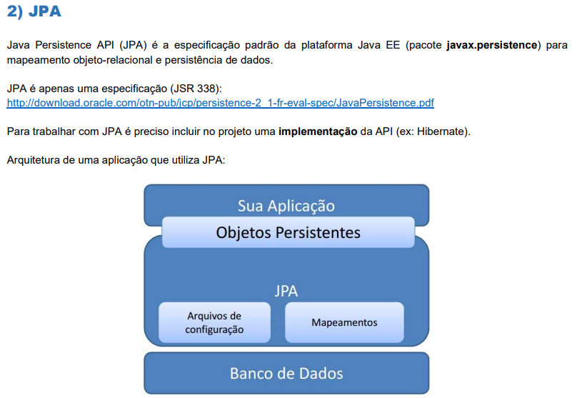

## Java EE:
- É uma plataforma para desenvolvimento de aplicações corporativas em Java. Fornece um conjunto de especificações e APIs para construir aplicações web, serviços web, componentes empresariais, entre outros.

- **JPA**: Java Persistence API, é uma especificação dentro do Java EE que define uma maneira padrão de gerenciar dados relacionais em aplicações Java. Ela facilita o mapeamento entre objetos Java e tabelas de banco de dados relacionais, permitindo que os desenvolvedores trabalhem com dados de forma mais intuitiva e orientada a objetos.

- **Hibernate** é uma implementação popular da especificação JPA. Ele fornece funcionalidades adicionais e otimizações para o mapeamento objeto-relacional, facilitando o desenvolvimento de aplicações que interagem com bancos de dados relacionais.

### Motivações para usar JPA/Hibernate:
- **Abstração do Banco de Dados**: Permite que os desenvolvedores trabalhem com objetos Java em vez de escrever SQL diretamente, o que torna o código mais legível e fácil de manter.
- Aquele trabalho de escrever com set e get com enorme blocos de código com transporte de dados entre a aplicação e o banco de dados. 

---

---
### Principais classes
- *EntityManager*: Um objeto EntityManager encapsula uma conexão com a base de dados e serve para efetuar operações de
acesso a dados (inserção, remoção, deleção, atualização) em entidades (clientes, produtos, pedidos, etc.)
por ele monitoradas em um mesmo contexto de persistência. 

- Ou seja, o EntityManager é a interface principal usada para interagir com o banco de dados através do JPA. Ele gerencia o ciclo de vida das entidades e permite realizar operações como persistência, consulta, atualização e remoção de dados.

- *EntityManagerFactory*: É uma fábrica para criar instâncias de EntityManager. Ele é responsável por configurar a conexão com o banco de dados e fornecer EntityManagers conforme necessário.

