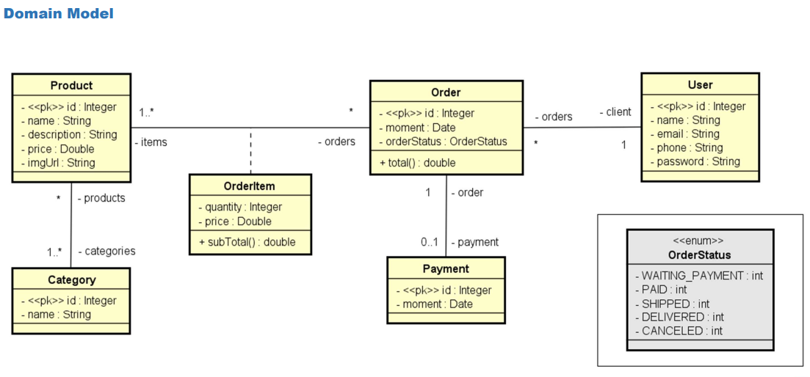

## Projeto Web Services com Spring Boot e JPA / Hibernate
- Este projeto foi desenvolvido com o objetivo de criar um sistema de web services robusto utilizando Java, Spring Boot e persistência de dados relacional com JPA e Hibernate.

## Objetivos do Projeto
* Implementar um modelo de domínio completo com associações.
* Estruturar o projeto em camadas lógicas: Resource, Service e Repository.
* Configurar banco de dados de teste (H2) e povoar a base de dados automaticamente.
* Realizar operações de CRUD (Create, Retrieve, Update, Delete) e tratamento de exceções.

## Diagrama
---

---

## Tecnologias Utilizadas
* **Java** com **Spring Boot**.
* **Maven**: Gerenciador de dependências.
* **JPA / Hibernate**: Mapeamento objeto-relacional.
* **H2 Database**: Banco de dados em memória para testes.
* **PostgreSQL**: Banco de dados relacional para ambiente de desenvolvimento.
* **Postman**: Ferramenta para testes de requisições API.

## Requisitos e Instalação
Para executar este projeto localmente, você precisará:
1. **Java JDK**: Versão 17 ou superior.
2. **PostgreSQL**: Instalado e rodando localmente.
3. **Maven**: Para compilação e gestão de dependências.

### Configuração do Banco de Dados (PostgreSQL Local)
* **Download**: [https://www.postgresql.org/download/](https://www.postgresql.org/download/).
* **Super usuário padrão**: `postgres`.
* **Senha sugerida**: `1234567`.
* **Porta padrão**: `5432`.
* **Base de dados**: Criar uma base chamada `springboot_course` no pgAdmin.

## Modelo de Domínio
O sistema gerencia as seguintes entidades e suas relações:
* **User**: Clientes com nome, email, telefone e senha .
* **Order**: Pedidos realizados, associados a um cliente e um status.
* **Category**: Categorias como "Electronics" e "Books".
* **Product**: Produtos com preço e descrição.
* **OrderItem**: Itens de um pedido com quantidade e preço.
* **Payment**: Registro do pagamento de um pedido.

## Como Executar
O projeto possui dois perfis principais de configuração:

### 1. Perfil de Teste (H2)
Utilizado para desenvolvimento rápido sem necessidade de banco externo.
* Configure `spring.profiles.active=test` no arquivo `application.properties`.
* O banco H2 pode ser acessado em `/h2-console`.

### 2. Perfil de Desenvolvimento (PostgreSQL)
Utilizado para persistência real em banco de dados local.
* Configure `spring.profiles.active=dev` no arquivo `application.properties`.
* Certifique-se de que as credenciais no arquivo `application-dev.properties` correspondem ao seu PostgreSQL local.

## Camadas Lógicas

1. **Resource (Controllers)**: Endpoints REST (ex: `/users`, `/orders`).
2. **Service**: Lógica de negócio e tratamento de erros.
3. **Repository**: Interfaces de acesso aos dados.
4. **Entities**: Mapeamento das tabelas do banco.
