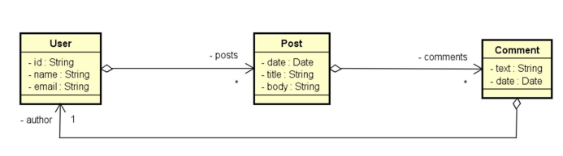

# Workshop Spring Boot & MongoDB
- Este projeto foi desenvolvido para aplicar conceitos de persistência de dados em um banco orientado a documentos utilizando Spring Boot e MongoDB.

## Requisitos do Sistema

Para rodar este projeto, você precisará das seguintes ferramentas instaladas:

* **Java JDK**: Versão compatível com Spring Boot.
* **MongoDB Community Server**: O motor do banco de dados NoSQL.
* **MongoDB Compass**: Interface gráfica para gerenciar e visualizar seus documentos.
* **Ambiente de Desenvolvimento (IDE)**: Como STS (Spring Tool Suite), IntelliJ ou VS Code.

## Diagrama:
---


---

## Configuração e Execução
### 1. Inicializando o Banco de Dados
Antes de rodar a aplicação, o serviço do MongoDB deve estar ativo. Dependendo da sua instalação, utilize o comando abaixo no terminal:

```bash
C:\Program Files\MongoDB\Server\8.2\bin>mongod

```
### 2. Conexão com a Base de Dados
A aplicação está configurada para se conectar automaticamente através do arquivo `application.properties`:
* **URI de Conexão**: `mongodb://localhost:27017/workshop_mongo`.
* **Base de Dados**: `workshop_mongo`.


### 3. Carga Inicial
- Ao iniciar a aplicação, a classe `Instantiation` povoará o banco automaticamente com dados de teste para usuários e posts.
## Arquitetura e Decisões de Design
O projeto segue o padrão de camadas para facilitar a manutenção e escalabilidade:

* **Domain**: Entidades que mapeiam os documentos do MongoDB (`User`, `Post`).
* **Repository**: Interfaces que utilizam `MongoRepository` para acesso aos dados.
* **Service**: Camada de lógica de negócio e tratamento de exceções como `ObjectNotFoundException`.
* **Resource**: Controladores REST que expõem os endpoints da API.
* **DTO (Data Transfer Object)**: Utilizado para otimizar o tráfego de rede e proteger dados sensíveis.


## Funcionalidades Implementadas
* **CRUD Completo de Usuários**: Inserção, busca, atualização e deleção.
* **Associações**: Implementação de objetos aninhados (como comentários em posts) e referências a outros documentos.
* **Buscas Customizadas**:
* Consulta por título de post utilizando *Query Methods*.
* Consulta avançada com múltiplos critérios e intervalo de datas utilizando `@Query`.

